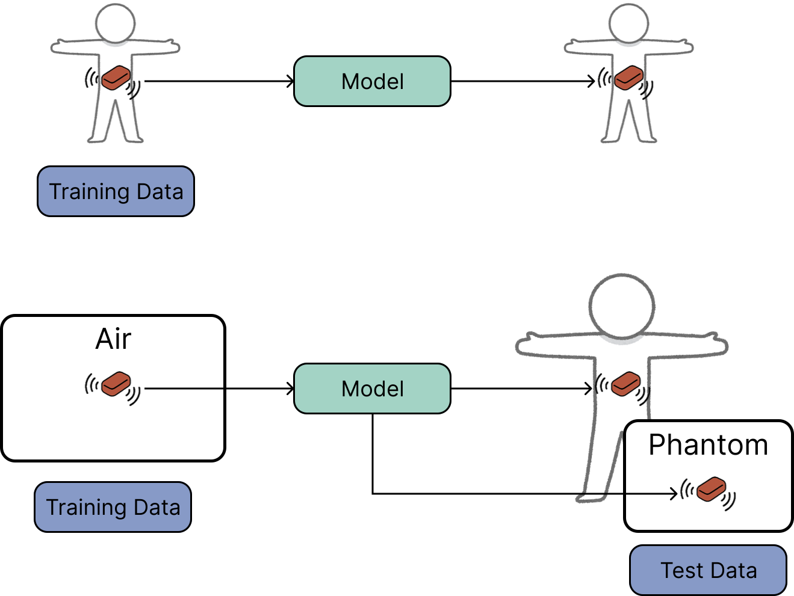
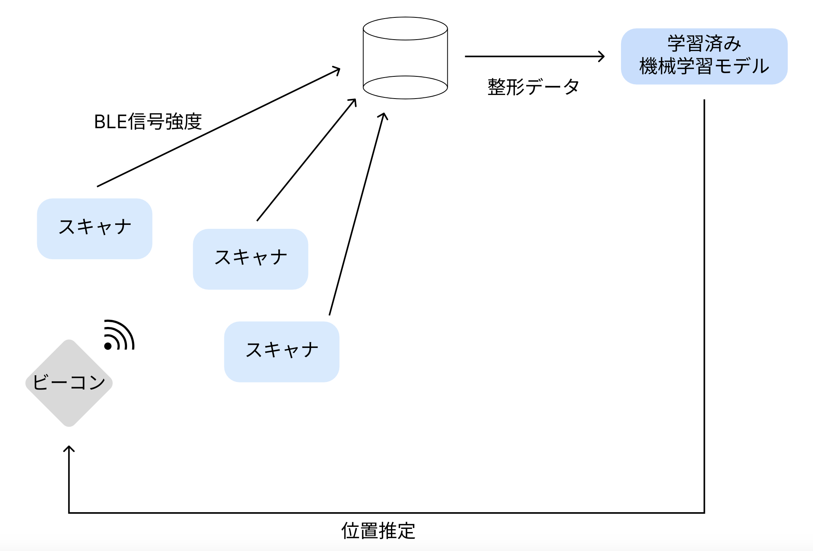
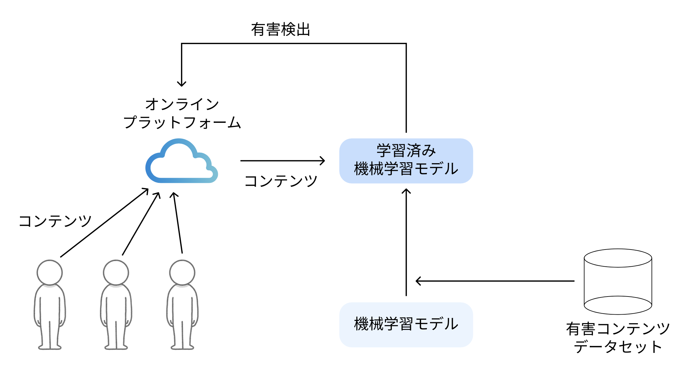

最終更新日: 2025/06/09  
Last Updated: 2025/06/09  

<!---

--->

# 目次
1. [所属 / Affiliation](#所属--Affiliation)
1. [経歴 / Career](#経歴--Career)
1. [研究業績 / Publications](#経歴--Career)
1. [現在の取り組み / Current Actives](#現在の取り組み--Current-Actives)
1. [過去の取り組み / Past Actives](#過去の取り組み--Past-Actives)
1. [参考 / References](#参考--References)

# 所属 / Affiliation
大阪公立大学 大学院 情報学研究科 基幹情報学専攻 システム情報学分野 スマートプラットフォーム研究室  
Osaka Metropolitan Graduate University, Faculty of Informatics, Department of Core Informatics, Smart Platform Lab.

研究室Webページ: [https://omusp.jp/](https://omusp.jp/)

# 経歴 / Career
- 大阪市立大学 工学部 電気情報工学科 2024/03 卒業  
  Graduated from Osaka City University, Faculty of Engineering, Department of Electric and Information Engineering at 2024/03 
- 大阪公立大学 大学院 情報学研究科 基幹情報学専攻 システム情報学分野 2026/03 修了予定  
  Expected to graduate from Osaka Metropolitan Graduate University, Faculty of Informatics, Department of Core Informatics, System Informatics at 2026/03

# 発表履歴

## International Conference Proceedings

### 2025

## Japanese Domestic Conference Papers

### 2025
- "コンテンツモデレーションシステムの構築に向けたオンラインソーシャルメディア上の有害コンテンツ検出"，江種 大希，小川 唯，阿多 信吾，藤本 まなと，情報通信マネジメント研究会（ICM研究会），石垣島市民会館，沖縄県，2025年3月
- "日本語アスペクトカテゴリ検出における翻訳データセットの有効性"，田中大智，江種大希，阿多信吾，藤本まなと，電子情報通信学会関西支部学生会第29回学生会研究発表講演会，p. 24，大阪公立大学杉本キャンパス，大阪府，2025年3月
- "機械学習に基づく3次元生体内機器位置推定法に関する一検討"，江種大希，土田純平，小林匠，藤本まなと，安在大祐，電子情報通信学会技術研究報告，Vol. 125，No. 22，MICT2025-3，pp. 12-17，KKR伊豆長岡千歳荘，静岡県，2025年5月
- "機械学習を用いた生体内位置推定における学習データ削減に関する一検討（発表予定）"，江種大希，小林匠，藤本まなと，安在大祐，電子情報通信学会技術研究報告，Vol. xxx，No. xx，MICT2025-xx，pp. xx-xx，山形テルサ，山形県，2025年7月

### 2024
- "有害コンテンツ検出のためのデータセット作成"，江種大希，小川唯，金澤真理，阿多信吾，藤本まなと，電子情報通信学会関西支部学生会第28回学生会研究発表講演会，p. 12，関西大学千里山キャンパス，大阪府，2024年3月
- "介護施設利用者の生きがい形成 ―Be supporters!の活動事例分析―"，森田賢，大塚祐多，金田喜久，出雲貴幸，中尾嘉宏，中曽禎啓，江種大希，小川唯，藤本まなと，内田由紀子，第43回日本認知症学会学術集会，ポスター発表，p. 252，ビッグパレットふくしま，福島県，2024年11月

### 2023
- "家庭内におけるWell-beingの影響調査に向けた位置情報取得システムの検討"，江種大希，中曽禎啓，小川唯，藤本まなと，阿多信吾，電子情報通信学会ソサイエティ大会，B-15-45，p. 370，名古屋大学東山キャンパス，愛知県，2023年9月
- "*[ポスター講演]* Well-beingの影響調査に向けた家族の同室滞在時間把握のための位置情報取得システムの開発と評価"，江種大希，中曽禎啓，小川唯，藤本まなと，阿多信吾，超知性ネットワーキングに関する分野横断型研究会（RISING），北海道立道民活動センターかでる2・7，北海道，2023年10月

# 現在の取り組み / Current Actives
## 機械学習に基づく3次元生体内機器位置推定

### 研究背景
近年，健康長寿社会の実現に向け，生体内において人の代わりに操作・活動ができるという生体内サイバネティックアバタの開発が活発におこなわれている．
これは多様なインプラントデバイスによって実現されるが，詳細な体内環境情報の取得にはインプラントデバイスの位置推定技術が必要である．
本研究では磁界を用いた位置推定手法を検討し，そこで用いられる様々な機械学習モデルに対して，人体を模擬した生体等価液体ファントムを用いた位置推定精度を評価する．

### 研究成果
"機械学習に基づく3次元生体内機器位置推定法に関する一検討"，江種大希，土田純平，小林匠，藤本まなと，安在大祐，電子情報通信学会技術研究報告，Vol. 125，No. 22，MICT2025-3，pp. 12-17，KKR伊豆長岡千歳荘，静岡県，2025年5月  

"機械学習を用いた生体内位置推定における学習データ削減に関する一検討（発表予定）"，江種大希，小林匠，藤本まなと，安在大祐，電子情報通信学会技術研究報告，Vol. xxx，No. xx，MICT2025-xx，pp. xx-xx，山形テルサ，山形県，2025年7月  

## 家庭内におけるWell-beingの影響調査に向けた位置情報取得システムの検討

### 研究背景
近年，家族が共に同じ時間をより多く過ごすことでWell-beingが向上することが示唆されており，その影響を調査する重要性が高まっています．
そのために，位置情報と同室滞在時間を把握することが必要となりますが，そのためのシステムは「小型で」「安価で」「負担がかからないこと」が求められます．
本システムは先述の条件を満たすためにBLE信号を用いて計測を行いますが，この信号はノイズが多いためにナイーブなアルゴリズムでは精度が悪いことが特徴の一つとして挙げられます．

### 研究成果
"家庭内におけるWell-beingの影響調査に向けた位置情報取得システムの検討"，江種大希，中曽禎啓，小川唯，藤本まなと，阿多信吾，電子情報通信学会ソサイエティ大会，B-15-45，p. 370，名古屋大学東山キャンパス，愛知県，2023年9月

"[ポスター講演] Well-beingの影響調査に向けた家族の同室滞在時間把握のための位置情報取得システムの開発と評価"，江種大希，中曽禎啓，小川唯，藤本まなと，阿多信吾，超知性ネットワーキングに関する分野横断型研究会（RISING），北海道立道民活動センターかでる2・7，北海道，2023年10月

"介護施設利用者の生きがい形成 ―Be supporters!の活動事例分析―"，森田賢，大塚祐多，金田喜久，出雲貴幸，中尾嘉宏，中曽禎啓，江種大希，小川唯，藤本まなと，内田由紀子，第43回日本認知症学会学術集会，ポスター発表，p. 252，ビッグパレットふくしま，福島県，2024年11月

プレスリリース：[高齢者施設の利用者の幸福度が「推し活」とともに段階的に進展することを確認](https://prtimes.jp/main/html/rd/p/000000016.000075017.html)

<!---
### 使用言語・技術スタック
  

- Python
- Tensorflow
- Tensorboard
- PyTorch
- wandb
- Scikit-learn
- Pandas
- Linux (Ubuntu22.04 / RasberryPi OS)
- InfluxDB
- Matplotlib
- Seaborn
--->

# 過去の取り組み / Past Actives
## オンラインプラットフォーム上の誹謗中傷検出

### 研究背景
近年，ソーシャルメディアは急速な発展を遂げていますが，これに伴い誹謗中傷やネットいじめ，ヘイトスピーチといった有害なコンテンツの投稿が増大していることが問題となっています．
こうした有害なコンテンツの検出は利用者にとっても身を守るという点で有効であるだけでなく，サービスを提供するプラットフォーマにとってもそのサービスの評価に影響を与えるという点で有効です．
有害コンテンツの検出に関する研究は特に英語圏で盛んですが，一方で日本語圏における研究はまだ不十分であることが指摘されています．

### 研究成果
"有害コンテンツ検出のためのデータセット作成"，江種大希，小川唯，金澤真理，阿多信吾，藤本まなと，電子情報通信学会関西支部学生会第28回学生会研究発表講演会，p. 12，関西大学千里山キャンパス，大阪府，2024年3月

"コンテンツモデレーションシステムの構築に向けたオンラインソーシャルメディア上の有害コンテンツ検出"，江種 大希，小川 唯，阿多 信吾，藤本 まなと，情報通信マネジメント研究会（ICM研究会），石垣島市民会館，沖縄県，2025年3月

<!---
### 使用言語・技術スタック
  

- Python
- Django
- Vue.js
- Tensorflow
- Scikit-learn
- Linux (Ubutnu22.04)
- MongoDB
- Pandas
- Sudachi
--->

## 大規模言語モデル開発
### 概要
大規模言語モデル開発 開発メンバーとして参加．
@東京大学 松尾研究室 LLMコミュニティ
(2024/02-2024/06)

参考URL: https://weblab.t.u-tokyo.ac.jp/2024-02-02/

<!---
### 開発リポジトリ
https://github.com/geniacllm

### 使用言語・技術スタック
  

- Srum
- Python
- Multi-thread
- Multi-GPU
- parallel
--->

## DX HACK（ハッカソン）参加
### 概要
BIPROGY主催のハッカソン "DX HACK" に参加．
(2024/05/18-19)

### 結果
『オーディエンス賞』 受賞  
ブログ執筆: https://qiita.com/Yorozuya59/items/116a72021ea8e7505892

<!---
### 使用言語・技術スタック
- make
- kintone
- (Javascript)
- (React)

()内は，参加メンバーが利用
--->

# 参考 / References
所属研究室HP: https://omusp.jp/  
Qiita: https://qiita.com/Yorozuya59  
AtCoder: https://atcoder.jp/users/yorozuya  
Kaggle: https://www.kaggle.com/yorozuya59  
